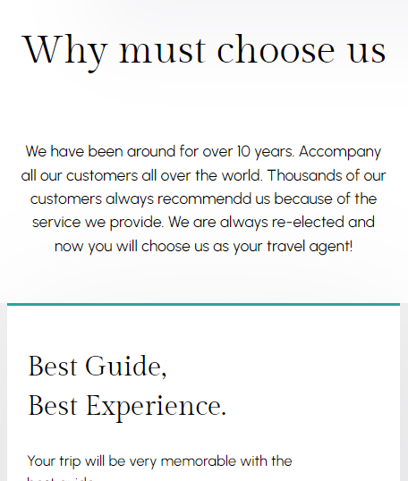

# travel-website
The travel-website is a responsive website created with a the mobile first approach that is meant to serve the purpose of attracting tourists to join the agency.
The travel-website has a home, destination, guide, and contact section.

## Table of Contents

- [Project Name](#project-name)

 - [Table of Contents](#table-of-contents)

  - [Introduction](#introduction)

  - [Live Demo](#live-demo)

  - [Features](#features)

  - [Technologies Used](#technologies-used)

  - [Setup and Installation](#setup-and-installation)

  - [Usage](#usage)

  - [Screenshots](#screenshots)

  - [License](#license)

  - [Author(s)](#authors)

## Introduction

The travel-website is a responsive website created with a the mobile first approach that is meant to serve the purpose of attracting tourists to join the agency.
The travel-website has a home, destition, guide, and contact section.

## Live Demo

Check out the live demo of the project: [Live Demo Link](https://example.com) /* not yet there */

## Features

- The website has four section each of which provides the user with concise information/guide about the agency.

## Technologies Used

- HTML

- CSS

- JavaScript

- Any other frameworks, libraries, or tools used (e.g., Bootstrap, Tailwind CSS, React)

## Setup and Installation

The user is only required to search for the website and if convinced to join the agency, more information is required to be provided so as to get in direct contact.

1\. **Clone the repository:**

    ```sh

    git clone https://github.com/EscHaleem/travel-website.git

    ```

2\. **Navigate to the project directory:**

    ```sh

    cd travel-website

    ```

3\. **Install dependencies:**

    ```sh

    npm install

    ```

    or if you are using yarn:

    ```sh

    yarn install

    ```

4\. **Run the project:**

    ```sh

    npm start

    ```

    or if you are using yarn:

    ```sh

    yarn start

    ```

## Usage

An email address might needed so as to get in contact with the potential client interested in using the travelling agency.

## Screenshots




## License

This project is licensed under the MIT License - see the [LICENSE](LICENSE) file for details.

## Author

- **Name:** Haleem

- **Email:** haleemkhaleed2262@gmail.com

- **GitHub:** [EscHaleem](https://github.com/EscHaleem)
